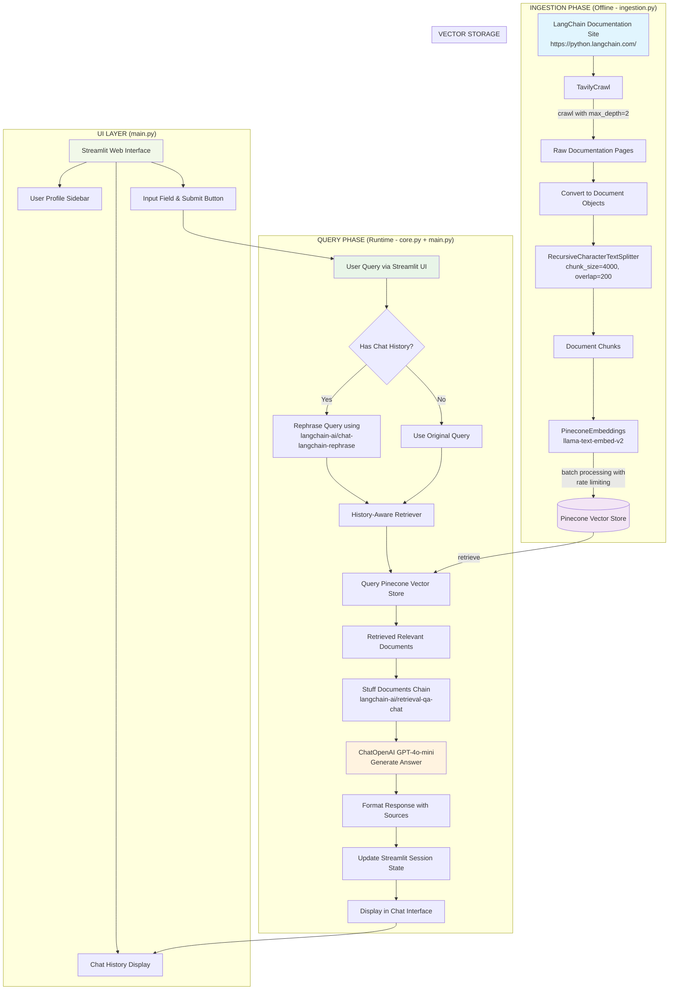

## Full Flow Explanation

This documentation helper app implements a **Retrieval-Augmented Generation (RAG)** system with two main phases: an offline ingestion phase and a runtime query phase. Here's how each component works:

### 🏗️ **Architecture Overview**

The app follows a typical RAG architecture:

- **Ingestion Pipeline** (`ingestion.py`): Crawls, processes, and indexes documentation
- **RAG Engine** (`core.py`): Handles retrieval and generation logic
- **UI Interface** (`main.py`): Provides user interaction via Streamlit

### 📥 **Phase 1: Ingestion Pipeline (`ingestion.py`)**

**Purpose**: Prepare documentation for efficient retrieval

1. **Web Crawling**:

   - Uses `TavilyCrawl` to crawl LangChain documentation
   - Crawls `https://python.langchain.com/` with `max_depth=2`
   - Extracts content from multiple documentation pages

2. **Document Processing**:

   - Converts crawled data to LangChain `Document` objects
   - Each document includes content and metadata (URL, title, source)

3. **Text Chunking**:

   - Uses `RecursiveCharacterTextSplitter` with:
     - `chunk_size=4000` characters
     - `chunk_overlap=200` characters for context preservation
   - Splits large documents into manageable chunks for better retrieval

4. **Vector Embedding & Storage**:
   - Converts chunks to embeddings using `PineconeEmbeddings` (llama-text-embed-v2)
   - Stores embeddings in **Pinecone vector database** with careful rate limiting
   - Implements exponential backoff for rate limit handling
   - Processes in batches of 3 documents with 3-second delays

### 🔍 **Phase 2: Query Processing (`core.py`)**

**Purpose**: Retrieve relevant information and generate answers

1. **Query Analysis**:

   ```python
   def run_llm(query: str, chat_history: List[Dict[str, Any]] = []):
   ```

   - Determines if query rephrasing is needed based on chat history

2. **History-Aware Retrieval**:

   - **With history**: Uses `langchain-ai/chat-langchain-rephrase` prompt to rephrase query considering conversation context
   - **Without history**: Uses original query directly
   - Creates `history_aware_retriever` for context-aware document retrieval

3. **Document Retrieval**:

   - Queries Pinecone vector store using semantic similarity
   - Retrieves most relevant document chunks
   - Logs detailed information about retrieved documents (source, title, content preview)

4. **Answer Generation**:
   - Uses `langchain-ai/retrieval-qa-chat` prompt template
   - Combines retrieved documents with user query
   - Generates response using **ChatOpenAI (GPT-4o-mini)**
   - Returns structured result with answer and source context

### 🖥️ **Phase 3: User Interface (`main.py`)**

**Purpose**: Provide interactive chat interface

1. **Streamlit Setup**:

   - Modern dark theme with custom CSS
   - User profile sidebar with Gravatar integration
   - Responsive layout with columns

2. **Session Management**:

   ```python
   st.session_state["chat_answers_history"] = []
   st.session_state["user_prompt_history"] = []
   st.session_state["chat_history"] = []
   ```

   - Maintains conversation history across interactions

3. **Query Flow**:

   - User enters query → calls `run_llm()` → displays response with sources
   - Updates session state with conversation history
   - Formats sources as numbered list

4. **Chat Display**:
   - Shows conversation history in chat message format
   - Displays both user queries and assistant responses
   - Includes source citations for transparency

### 🔧 **Key Technologies & Design Decisions**

**Vector Storage**:

- **Pinecone** chosen over Chroma for production scalability
- Implements conservative rate limiting (3 docs/batch, 3s delays)

**Embedding Model**:

- Uses **PineconeEmbeddings** with `llama-text-embed-v2`
- Alternative OpenAI embeddings commented out for comparison

**LLM**:

- **GPT-4o-mini** for cost-effective, fast responses
- Temperature=0 for consistent, deterministic outputs

**Framework Integration**:

- **LangChain** for RAG pipeline orchestration
- **Streamlit** for rapid UI development
- Hub prompts for proven prompt templates

### 🔄 **Complete Workflow**

1. **Setup** (One-time): Run `ingestion.py` to populate vector store
2. **Runtime**: User interacts through Streamlit interface
3. **Per Query**:
   - User submits question
   - System retrieves relevant docs from Pinecone
   - LLM generates contextual answer
   - Response displayed with source citations
   - Conversation history updated for context-aware follow-ups

### Diagram


